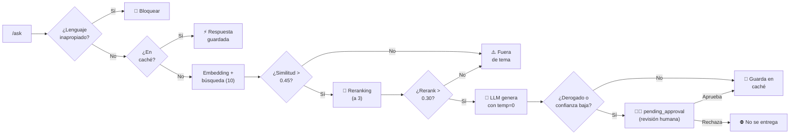

<div align="center">

# ⚖️ Asistente de Consulta — Ley de Contrato de Trabajo

**Sistema RAG que responde consultas sobre la Ley 20.744 (Argentina), citando el artículo exacto**

[](https://www.python.org/)
[](https://fastapi.tiangolo.com/)
[](https://www.trychroma.com/)
[](https://cohere.com/)

_Challenge Final — Get Talent (Pi Data)_

</div>

---

## 📑 Contenido

- [El problema](#-el-problema)
- [Instalación](#-instalación)
- [Endpoints](#-endpoints)
- [Interfaz gráfica](#-interfaz-gráfica-opcional)
- [Preguntas de ejemplo](#-preguntas-de-ejemplo)
- [Arquitectura](#-arquitectura)
- [Base de conocimiento](#-base-de-conocimiento)
- [Calidad de respuesta](#-calidad-de-respuesta)
- [Evaluación](#-evaluación)
- [IA Responsable](#-ia-responsable)
- [Human in the Loop](#-human-in-the-loop)
- [Verificación](#-verificación)
- [Limitaciones](#-limitaciones-conocidas)

---

## 🎯 El problema

|                  |                                                                                                                                                                                                                                                  |
| ---------------- | ------------------------------------------------------------------------------------------------------------------------------------------------------------------------------------------------------------------------------------------------ |
| **Problema**     | La Ley de Contrato de Trabajo (20.744) tiene más de 280 artículos y fue reformada en marzo de 2026 (Ley 27.802), que sustituyó o derogó partes del articulado. Encontrar el artículo que responde una duda concreta —y saber si sigue vigente— no es inmediato. |
| **Usuario**      | Trabajadores y empleadores sin formación jurídica, que tienen una duda puntual: cuántos días de vacaciones les tocan, cuánto dura el período de prueba, con cuánta anticipación hay que avisar un despido.                                          |
| **Necesidad**    | Una respuesta en lenguaje simple, **con el artículo exacto** para poder verificarla, que advierta si la norma está derogada y que diga "no sé" cuando la ley no lo dice, en vez de inventar.                                                        |
| **Solución**     | Un asistente RAG que responde **solo con el texto vigente de la ley**, cita el artículo, advierte los derogados, se niega cuando la evidencia no alcanza y manda a **revisión humana** las respuestas con evidencia dudosa.                          |

### Por qué IA, y por qué RAG

- **Por qué no un buscador por palabras:** la gente no pregunta con las
  palabras de la ley. Dice "aguinaldo", "casamiento" u "hora extra"; la ley
  dice "sueldo anual complementario", "matrimonio" y "horas suplementarias".
  La búsqueda semántica por embeddings encuentra el artículo igual: en la
  [evaluación](#-evaluación), esas tres preguntas trajeron el artículo
  correcto en primer lugar.
- **Por qué no un chatbot general sin RAG:** lo que sabe un modelo puede ser
  anterior a la reforma de 2026, no dice de dónde saca cada dato y, si no
  sabe, puede inventar. Con RAG cada respuesta sale del texto vigente, trae
  sus fuentes y, si el texto no lo dice, el sistema se niega.
- **Por qué no reentrenar un modelo (fine-tuning):** la ley cambia. Con RAG,
  actualizarla es volver a descargar el texto y correr la ingesta, sin
  entrenar nada.

---

## ⚙️ Instalación

**1.** Instalar dependencias

```bash
pip install -r requirements.txt
```

**2.** Copiar `.env.example` como `.env` y completar con la clave de Cohere

```bash
COHERE_API_KEY=tu_api_key_aca
```

**3.** Cargar la base de conocimiento (una sola vez)

```bash
python descargar_ley.py         # descarga y limpia el texto de la ley
python ingesta.py --verificar   # revisa el parseo SIN llamar a Cohere
python ingesta.py               # genera embeddings y carga ChromaDB
```

**4.** Levantar la API

```bash
uvicorn main:app --reload
```

> 💡 Documentación interactiva en **http://localhost:8000/docs**
> Verificación rápida en **http://localhost:8000/health**

**5.** (Opcional) Levantar la interfaz gráfica, en **otra terminal**, con la API
del paso 4 corriendo

```bash
streamlit run gui.py
```

Se abre sola en el navegador en `http://localhost:8501`.

---

## 🔌 Endpoints

|     | Método | Ruta        | Descripción                                                                         |
| :-: | :----: | ----------- | ----------------------------------------------------------------------------------- |
| 💚  | `GET`  | `/health`   | Estado del servicio: fragmentos indexados, modelos, Top-K, umbrales, caché          |
| 🔍  | `POST` | `/retrieve` | **Solo retrieval**: devuelve los fragmentos recuperados con sus scores, sin llamar al LLM |
| 💬  | `POST` | `/ask`      | Pregunta → retrieval → contexto → prompt → LLM → respuesta + fuentes                |

**Human in the Loop** (ver [la sección](#-human-in-the-loop)):

|     | Método | Ruta                             | Quién la usa | Descripción                                               |
| :-: | :----: | -------------------------------- | ------------ | --------------------------------------------------------- |
| 📥  | `GET`  | `/revisiones/pendientes`         | Revisor      | Respuestas retenidas, con la propuesta de la IA y el motivo |
| ✅  | `POST` | `/revisiones/{id}/aprobar`       | Revisor      | La respuesta se entrega y pasa al caché                   |
| ❌  | `POST` | `/revisiones/{id}/rechazar`      | Revisor      | La respuesta no se entrega nunca                          |
| 🔎  | `GET`  | `/revisiones/{id}`               | Usuario      | Estado de su consulta; el texto aparece solo si fue aprobada |

Todos los errores salen con el mismo formato `{"error": "..."}`: `422` si la
entrada es inválida (pregunta vacía, JSON mal formado), `503` si Cohere no
responde, `404` si la ruta o la revisión no existe, `409` si se intenta resolver una
revisión ya resuelta.

<details>
<summary><b>Ver ejemplo de <code>/retrieve</code></b></summary>

<br>

`top_k` (1 a 10, por defecto 3) y `excluir_derogados` (por defecto `false`)
son opcionales.

```bash
curl -X POST http://localhost:8000/retrieve \
  -H "Content-Type: application/json" \
  -d '{"pregunta": "que dice la ley sobre el periodo de prueba", "top_k": 3}'
```

**Respuesta** (texto recortado):

```json
{
  "pregunta": "que dice la ley sobre el periodo de prueba",
  "pertinente": true,
  "motivo": "ok",
  "similarity_score": 0.7111,
  "umbral_similitud": 0.45,
  "umbral_rerank": 0.3,
  "fragmentos": [
    { "articulo": "92 bis", "score": 0.7111, "score_rerank": 0.8451, "derogado": false, "texto": "Art. 92 bis. — Período de prueba. ..." },
    { "articulo": "231",    "score": 0.5518, "score_rerank": 0.7817, "derogado": false, "texto": "Art. 231. —Plazos. ..." },
    { "articulo": "50",     "score": 0.6281, "score_rerank": 0.5695, "derogado": false, "texto": "Art. 50. —Prueba. ..." }
  ]
}
```

`motivo` explica la decisión: `ok`, `sin_resultados`, `similitud_bajo_umbral`
o `rerank_bajo_umbral`. Si no es pertinente, igual se devuelven los mejores
candidatos, para poder ver por qué no alcanzaron.

</details>

<details>
<summary><b>Ver ejemplo de <code>/ask</code></b></summary>

<br>

```bash
curl -X POST http://localhost:8000/ask \
  -H "Content-Type: application/json" \
  -d '{"pregunta": "cuantos dias de vacaciones me corresponden con 8 años de antiguedad"}'
```

**Respuesta** (se muestra solo la primera de las tres fuentes):

```json
{
  "pregunta": "cuantos dias de vacaciones me corresponden con 8 años de antiguedad",
  "estado": "respondida",
  "id_revision": null,
  "motivos_revision": [],
  "respuesta": "Según el artículo 150, te corresponden 21 días corridos de vacaciones.\n\nEste artículo establece que los trabajadores con una antigüedad mayor a cinco años, pero que no supere los diez, tienen derecho a veintiún días corridos de descanso anual remunerado.",
  "fuentes": [
    { "articulo": "150", "titulo": "V - De las Vacaciones y otras Licencias", "capitulo": "I - Régimen General", "derogado": false, "score": 0.6578, "score_rerank": 0.8679 }
  ],
  "similarity_score": 0.6578,
  "grounded": true,
  "desde_cache": false,
  "aviso": "Información general basada en el texto de la Ley 20.744. No constituye asesoramiento legal. Ante un caso concreto, consultá a un profesional del derecho."
}
```

</details>

---

## 🖥️ Interfaz gráfica (opcional)

`gui.py` es una pantalla simple hecha con [Streamlit](https://streamlit.io/)
para consultar el asistente sin usar Swagger ni la terminal. **No es la API:
es una pantalla aparte que le hace pedidos a `/ask`.** Por eso hacen
falta dos procesos corriendo al mismo tiempo (ver [Instalación](#-instalación)).

Muestra la respuesta, los artículos citados —marcando en rojo si alguno está
derogado—, y el aviso legal. Si la API no está levantada, avisa con un
mensaje claro en vez de romperse.

---

## ❓ Preguntas de ejemplo

Todas salen del dataset de evaluación (`eval/dataset.json`) y se probaron
contra Cohere. Sirven para ver cada comportamiento del sistema.

**Se responden, citando el artículo:**

| Pregunta                                                                                                     | Artículo | Dato clave               |
| ------------------------------------------------------------------------------------------------------------ | :------: | ------------------------ |
| ¿Cuántos días de vacaciones me corresponden con 8 años de antigüedad?                                         |   150    | 21 días corridos         |
| ¿Cuánto dura el período de prueba?                                                                            |  92 bis  | 6 meses                  |
| ¿Cuánto se paga la hora extra?                                                                                |   201    | 50% y 100%               |
| ¿Cuántos días de licencia me dan por casamiento?                                                              |   158    | 10 días corridos         |
| ¿Cuándo se paga el aguinaldo?                                                                                 |   122    | 30 de junio y 18 de diciembre |
| Si tengo 3 años de antigüedad, ¿con cuánta anticipación me tiene que avisar el empleador antes de despedirme? |   231    | 1 mes                    |
| ¿Cuántos días de licencia corresponden por el fallecimiento de un hermano?                                    |   158    | 1 día                    |
| ¿Cuántas horas puede durar como máximo una jornada íntegramente nocturna?                                     |   200    | 7 horas                  |
| ¿A partir de qué edad se puede trabajar?                                                                      |   189    | 16 años                  |
| ¿Durante cuánto tiempo se presume que un despido es por causa del embarazo?                                   |   178    | 7 meses y medio          |

**Se niega, porque la ley no tiene el dato:**

- ¿Cuál es el monto actual del salario mínimo vital y móvil?
- ¿Cuántos días de licencia me corresponden por mudanza?

**Corta sin llamar al modelo, porque no es sobre la ley:**

- ¿Cuál es la capital de Francia?

**Queda en revisión humana (`pending_approval`):**

- ¿Qué dice la ley del trabajo nocturno? — recupera el art. 173, derogado.
- ¿Me pueden pagar con tickets de comida? — la evidencia es débil (rerank 0.49).

---

## 🏗️ Arquitectura

```
📁 proyecto/
├── 🌐 descargar_ley.py      Descarga y limpia el texto de la ley (se corre 1 vez)
├── 📥 ingesta.py            Parte por artículo, arma metadata, carga ChromaDB (se corre 1 vez)
├── 🐍 main.py               API: /health, /retrieve, /ask. Guardrail, caché, orquesta la respuesta
├── 🧠 rag.py                Retrieval (búsqueda + filtros + reranking), prompt, generación
├── 🧑‍⚖️ revisiones.py        Human in the Loop: criterios de riesgo y cola de revisión
├── 📋 schemas.py            Contratos de entrada y salida (Pydantic)
├── 🖥️ gui.py                Interfaz gráfica opcional (Streamlit), le pide a /ask
├── 📄 ley/ley_20744.txt     El texto fuente, limpio (175.753 caracteres)
├── 📊 eval/                 Dataset de 15 preguntas, script de evaluación y resultados
├── 🧪 tests/                Pruebas automáticas (pytest), sin llamar a Cohere
├── 📝 docs/                 Reporte de evaluación (HTML y Word)
├── 📓 documento_proceso.md  Cómo armé el proyecto, decisiones y aprendizajes
└── 🔐 .env                  Clave de Cohere (no versionado)
```

**Flujo de una consulta:**



Dos filtros en cascada, cada uno con su propia escala y su propia calibración
(ver [Calidad de respuesta](#-calidad-de-respuesta)): la similitud de embeddings
decide si el tema es pertinente; el reranking decide, entre los candidatos
pertinentes, cuáles responden la pregunta puntual.

### Modelos de Cohere utilizados

| Función                            | Modelo                    |
| ---------------------------------- | ------------------------- |
| Embeddings (indexación y búsqueda) | `embed-multilingual-v3.0` |
| Generación de respuestas           | `command-a-03-2025`       |
| Reranking                          | `rerank-v4.0-fast`        |

Los tres nombres están centralizados en constantes al inicio de `rag.py`
(`MODELO_EMBEDDINGS`, `MODELO_CHAT`, `MODELO_RERANK`), no repartidos por el
código. Cohere deprecó dos modelos durante el desarrollo de este mismo
proyecto —`command-r-plus` en septiembre de 2025 y `rerank-v3.5` en julio de
2026—, así que actualizar el nombre vigente es editar una sola línea.

---

## 📚 Base de conocimiento

|                            |                                                                                                                                                    |
| -------------------------- | -------------------------------------------------------------------------------------------------------------------------------------------------- |
| **Fuente**                 | Ley 20.744 (Contrato de Trabajo), texto actualizado, [argentina.gob.ar](https://www.argentina.gob.ar/normativa/nacional/norma-25552/actualizacion) |
| **Tamaño**                 | 175.753 caracteres (mínimo exigido: 100.000)                                                                                                       |
| **Artículos**              | 278 números distintos (1 a 278), sin faltantes, más 14 con sufijo bis/ter                                                                          |
| **Fragmentos indexados**   | 317                                                                                                                                                |
| **Estrategia de chunking** | Por **artículo completo**, no por caracteres fijos                                                                                                 |
| **Metadata por fragmento** | ley, número de artículo, título, capítulo, si está derogado                                                                                        |
| **Base vectorial**         | ChromaDB, `PersistentClient`, distancia coseno                                                                                                     |

**Por qué se chunkea por artículo y no por caracteres fijos:** la ley trae
reformas recientes con anotaciones de vigencia pegadas a cada artículo
(_"Artículo sustituido por art. 57 de la Ley Nº 27.802"_). Cortar por
caracteres fijos podía separar un artículo de su nota de vigencia, con el
riesgo de citar como vigente una norma derogada. Chunkear por artículo
garantiza que el texto y su estado de vigencia viajen siempre juntos.

Los artículos que superan los 1.500 caracteres (47 de 293) se subdividen,
porque Cohere trunca en silencio todo lo que supere ~512 tokens por texto.

---

## ✅ Calidad de respuesta

### Pertinencia — dos filtros en cascada

**Filtro 1 — similitud de embeddings (`UMBRAL_SIMILITUD = 0.45`)**

Calibrado con 6 mediciones reales contra el texto de la ley ya cargado:

| Consulta             | Score  |
| -------------------- | :----: |
| Salario mínimo       | 0.7188 |
| Período de prueba    | 0.7113 |
| Vacaciones (español) | 0.6578 |
| Vacaciones (inglés)  | 0.5654 |
| _(piso de señal)_    |        |
| Tarta de manzana     | 0.3440 |
| Capital de Francia   | 0.3303 |

Con 11 puntos de margen a cada lado, el umbral corta antes de gastar una
llamada al reranker o al modelo generativo.

**Filtro 2 — reranking (`UMBRAL_RERANK = 0.30`, escala independiente)**

Medido con las mismas consultas:

| Tipo de consulta             | Score de rerank |
| ---------------------------- | :-------------: |
| Pertinentes (mejor artículo) |   0.57 a 0.91   |
| Fuera de tema                |   0.09 a 0.11   |

La separación es más del doble de nítida que la de embeddings (brecha de 0.80
contra 0.37), porque el reranker lee la pregunta y el artículo **juntos**,
mientras que el embedding compara dos resúmenes numéricos calculados por
separado.

**Por qué dos filtros y no uno:** el embedding filtra si el _tema_ es
pertinente; el reranking filtra si el _artículo puntual_ responde la pregunta.
Son preguntas distintas. Ejemplo real detectado durante la calibración: en
_"qué dice la ley sobre el período de prueba"_, el artículo 50 (que regula
la _prueba_ como medio de acreditación del contrato, no el _período de
prueba_) entraba en el top 3 por similitud de vocabulario compartido —el
reranking lo bajó al tercer puesto y subió el artículo 231 (preaviso), al
que el propio 92 bis remite.

**Si el reranker no responde**, el sistema sigue funcionando con el orden de
similitud: es una mejora de calidad, no una dependencia crítica.

### Determinismo

`temperature = 0` en la generación, más un caché de respuestas
(`cache_respuestas.json`) indexado por la pregunta normalizada (sin tildes,
sin signos, sin mayúsculas). _"¿Cuántos días de vacaciones?"_ y _"cuantos
dias de vacaciones"_ devuelven exactamente la misma respuesta, verificado.

`temperature = 0` sola no garantiza determinismo absoluto en los LLM; el
caché sí.

### Formato

- **Sin emojis:** instrucción explícita en el prompt + filtro por rangos
  Unicode que los elimina de la respuesta aunque el modelo los genere.
- **Siempre en español:** instrucción en el prompt, verificado con una
  consulta en inglés.

---

### Validación de la salida

Durante las pruebas, `command-a` devolvió dos veces una salida degenerada
—la respuesta sobre horas extra se convirtió en miles de `3` seguidos— pese a
`temperature = 0`. No se pudo reproducir a voluntad, así que no se puede
evitar: hay que detectarla.

- `max_tokens = 400`: una respuesta normal ocupa ~250; un bucle se corta antes
  de crecer.
- Un detector de repetición (`es_degenerada()` en `rag.py`) revisa cada salida.
  Si la detecta, reintenta una vez; si vuelve a fallar, responde `503` y **no
  guarda nada en el caché**. Es preferible un error honesto a una respuesta
  basura que además quedaría fija para siempre.

---

## 📊 Evaluación

**Reporte completo:** [`docs/reporte_evaluacion.html`](docs/reporte_evaluacion.html)
(también en Word: `docs/reporte_evaluacion.docx`).

```bash
python eval/evaluar.py     # ~57 llamadas a Cohere, unos 3 minutos
```

Dataset de 15 preguntas (`eval/dataset.json`): 5 respondibles, 5 que exigen
un dato específico, 2 sin respuesta en la ley, 1 fuera de tema y 2 que deben
ir a revisión humana. Cada una con el artículo y los datos esperados,
verificados contra el texto de la ley.

| Qué se midió                                       | Solo embeddings | Con reranking |
| -------------------------------------------------- | :-------------: | :-----------: |
| Hit rate@3 (artículo correcto en el top 3)         |      0.909      |   **1.000**   |
| MRR                                                |      0.909      |   **0.939**   |

| Qué se midió                                              | Resultado            |
| --------------------------------------------------------- | -------------------- |
| Comportamiento esperado (responder / negarse / HITL)      | **15 de 15**         |
| Dato clave y artículo citado (chequeo automático)         | 11 de 11             |
| LLM-as-a-Judge: correcta / relevante / fundamentada (1-5) | 4.92 / 4.75 / 5.00   |
| Revisión manual: sin frases fuera del contexto            | **12 de 12**         |

**Lo que se aprendió:**

- **El reranker suma:** rescató el art. 189 en "¿a partir de qué edad se
  puede trabajar?", que solo con embeddings no entraba en el top 3.
- **Negarse bien depende del prompt:** en salario mínimo y licencia por
  mudanza los scores pasan los dos filtros; lo que evita inventar es la regla
  del prompt.
- **El modelo agregaba frases que no estaban en el contexto:** en una primera
  corrida, la revisión manual encontró 3 respuestas con datos sacados de su
  propio conocimiento. Se agregó la regla 2 del prompt (no agregar
  explicaciones ni consecuencias que no estén escritas en los artículos) y
  en la corrida final no pasó en ninguna.
- **El juez no lo había detectado:** con el mismo modelo como juez, les puso
  "fundamentada: 5" a esas respuestas. Por eso la revisión del HITL la hace
  una persona.
- **Un prompt más estricto tiene un costo:** las respuestas son más literales;
  en la de hora extra el modelo copió el artículo casi textual.

---

## 🛡️ IA Responsable

|     | Práctica                   | Implementación                                                                                                                                                                                                                    |
| :-: | -------------------------- | --------------------------------------------------------------------------------------------------------------------------------------------------------------------------------------------------------------------------------- |
| ⚓  | **Grounding doble**        | El score debe superar ambos umbrales. Además, si el propio modelo reconoce que el contexto no alcanza (caso real: salario mínimo vital), `grounded` se marca `false` aunque el score haya sido el más alto de toda la calibración |
| 🔒  | **Protección de datos**    | Los logs registran longitud de la consulta y scores, nunca el texto. Los `except` registran el tipo de excepción, no el mensaje, para no filtrar rutas ni claves                                                                  |
| 👁️  | **Transparencia**          | Cada respuesta incluye los artículos usados, los dos scores, si vino del caché, y un aviso legal fijo                                                                                                                             |
| ⚖️  | **Equidad**                | Filtro de lenguaje inapropiado con límite de palabra (`\b`), para no marcar términos legítimos que contengan una palabra bloqueada                                                                                                |
| 📋  | **No asesoramiento legal** | Aviso explícito en cada respuesta: es información general, no reemplaza a un profesional del derecho                                                                                                                              |
| 🔍  | **Trazabilidad**           | Cada consulta tiene un ID de traza; el log reconstruye los 5 pasos de la decisión (guardrail → caché → búsqueda → filtros → generación)                                                                                           |

---

## 🧑‍⚖️ Human in the Loop

```
IA analiza → evalúa si requiere supervisión → revisión humana → aprobar o rechazar → entregar o detener
```

### Qué hace la IA sola y qué requiere a una persona

| La IA resuelve sola                                                      | Requiere revisión humana (`pending_approval`)                               |
| ------------------------------------------------------------------------ | --------------------------------------------------------------------------- |
| Respuestas con evidencia clara: la mejor fuente tiene rerank ≥ 0.50      | **Confianza baja:** la mejor fuente quedó entre 0.30 y 0.50                 |
| Rechazar consultas fuera de tema o con lenguaje inapropiado              | **Artículo derogado** entre las fuentes finales de la respuesta             |
| Decir "no cuento con información suficiente" (se niega: no hay riesgo)   | **Sin medida de confianza:** el reranker no respondió                        |

El criterio es la **calidad de la evidencia, no el tema**. Una consulta
sobre despido o indemnización se responde sola si la ley la contesta con
claridad: frenarla no protegería a nadie, y como son de las consultas más
frecuentes, saturaría al revisor hasta que apruebe sin leer.

### Qué riesgo se mitiga

Que el sistema entregue **con apariencia de certeza** una respuesta que no
está bien respaldada, en un dominio donde el usuario puede tomar decisiones
económicas o legales con ella.

- **Confianza baja:** las consultas pertinentes calibradas dieron un rerank
  de 0.57 a 0.91, y las ajenas de 0.09 a 0.11. La franja 0.30–0.50 pasa el
  filtro pero ninguna medición la respalda: ahí decide mejor una persona que
  un umbral.
- **Derogados:** la base tiene 16 artículos derogados, varios por la reforma
  de marzo de 2026 (Ley 27.802). Si uno queda en el contexto, alguien tiene
  que verificar que la respuesta no se apoye en él.

### Casos reales (reproducibles para la demo)

| Consulta                               | Motivo                        | Qué encontró el revisor                                                                | Decisión     |
| -------------------------------------- | ----------------------------- | -------------------------------------------------------------------------------------- | ------------ |
| "qué dice la ley del trabajo nocturno" | `cita_articulo_derogado` (173) | La respuesta se apoya en los arts. 190 y 200, vigentes. El 173 no se usó               | ✅ Aprobar   |
| "me pueden pagar con tickets de comida" | `confianza_baja` (0.49)       | Describe lo que dice el art. 131 sobre descuentos al sueldo, pero no responde la pregunta. Lo que dice que el salario se paga en dinero es el art. 105, y los beneficios sociales del 103 bis ni se recuperaron | ❌ Rechazar  |

El segundo caso muestra por qué hace falta: la respuesta cita un artículo
real y describe bien lo que dice, pero ese artículo no contesta lo que se
preguntó. Con una versión anterior del prompt era peor: respondía "no, según
el art. 131" con total seguridad, y el LLM-as-a-Judge le había puesto 5/5/5.

### Cómo funciona

1. `POST /ask` genera la respuesta igual, pero si hay motivos de riesgo **no
   la entrega**: devuelve `estado: "pending_approval"`, un `id_revision` y los
   `motivos_revision`. Las fuentes sí se muestran.
2. El revisor ve la cola en `GET /revisiones/pendientes`, con la respuesta
   propuesta, las fuentes y el motivo.
3. Aprueba o rechaza con `POST /revisiones/{id}/aprobar` o `/rechazar`. El
   nombre del revisor es obligatorio y queda registrado, junto con su
   comentario y la fecha.
4. El usuario consulta `GET /revisiones/{id}`: si fue aprobada recibe la
   respuesta; si fue rechazada, un aviso de que no se pudo confirmar.

Reglas que cierran el circuito:

- Una respuesta pendiente **nunca** entra al caché: solo las aprobadas.
- Si se repite una pregunta pendiente, devuelve la misma revisión (no crea
  otra ni vuelve a llamar al modelo).
- Si se repite una pregunta rechazada, se respeta la decisión: no se genera
  de nuevo para que salga sola.
- Una revisión resuelta no se puede volver a resolver (`409`).

Las revisiones se guardan en `revisiones.json` (no versionado), así
sobreviven a un reinicio de la API.

---

## 🧪 Verificación

### Pruebas automáticas

```bash
pytest -v
```

28 pruebas de punta a punta sobre la API, en menos de un segundo. **No
llaman a Cohere ni necesitan la base vectorial:** ambos se reemplazan por
versiones falsas (`tests/conftest.py`) que responden lo que cada prueba
necesita. Así no gastan llamadas de la API, dan siempre el mismo resultado,
corren en cualquier computadora y permiten provocar casos difíciles de
conseguir con el modelo real (Cohere caído, reranker caído, salida
degenerada). Lo que se prueba es el código propio: filtros, umbrales, Human
in the Loop, caché y manejo de errores.

| Caso que pide la consigna      | Qué se prueba                                                                                         |
| ------------------------------ | ----------------------------------------------------------------------------------------------------- |
| Pregunta válida                | Responde con `estado: respondida`, `grounded: true` y aviso legal; la misma pregunta escrita distinto sale del caché |
| Sin evidencia suficiente       | Fuera de tema corta antes del reranker y del LLM; si el reranker descarta todo, no se llama al LLM; si el modelo dice que no alcanza, `grounded: false` |
| Recuperación de fuentes        | `/ask` devuelve las fuentes en el orden del reranker; `/retrieve` muestra los fragmentos sin llamar al LLM, filtra derogados por metadata y explica por qué algo no es pertinente |
| Respuesta del LLM              | Se entrega el texto generado, sin emojis; una salida degenerada se reintenta                          |
| Human in the Loop              | Derogado, confianza baja y reranker caído quedan en `pending_approval`; el usuario no ve el texto y el revisor sí; aprobar entrega y cachea; rechazar detiene y no regenera; una pregunta pendiente repetida no duplica la revisión |
| Error controlado               | `422` (pregunta vacía, JSON roto, `top_k` fuera de rango, revisor sin nombre), `503` sin detalles internos si Cohere cae, `404` y `409` en revisiones |

Para comprobar que las pruebas detectan fallas se rompió el código a
propósito: con el umbral de HITL en 0.40 fallan 6 pruebas, y sin caché
fallan 2.

Hay además una prueba real contra Cohere, que no corre por defecto porque
gasta llamadas:

```bash
PRUEBA_REAL=1 pytest -m real -v          # bash
$env:PRUEBA_REAL=1; pytest -m real -v    # PowerShell
```

### Pruebas manuales contra Cohere

Probado end-to-end contra la API de Cohere con el texto completo de la ley cargado:

| Caso                                                                                | Resultado                                                                 |
| ----------------------------------------------------------------------------------- | ------------------------------------------------------------------------- |
| 💬 Pregunta con respuesta en la ley                                                 | Cita el artículo exacto, `grounded: true`                                 |
| 🤷 Pregunta sobre un concepto que la ley define pero no cuantifica (salario mínimo) | Reconoce que no alcanza, `grounded: false`, pese al score más alto medido |
| 🌐 Pregunta en inglés                                                               | Responde en español                                                       |
| 🚫 Pregunta fuera de tema                                                           | Rechaza sin llamar al modelo generativo                                   |
| ⛔ Lenguaje inapropiado                                                             | Bloquea antes de buscar                                                   |
| 🔁 Misma pregunta, dos formas de escribirla                                         | Respuesta idéntica, `desde_cache: true` en la segunda                     |
| 🔀 Reranking vs. solo similitud                                                     | Corrige 2 de 3 casos con artículos citados de más                         |

---

## 📌 Limitaciones conocidas

- **No es asesoramiento legal.** El sistema informa qué dice la ley; no
  reemplaza la consulta a un profesional para un caso concreto.
- **Una sola norma indexada.** Solo la Ley 20.744. No contempla convenios
  colectivos, decretos reglamentarios ni jurisprudencia, que pueden modificar
  la aplicación práctica de un artículo.
- **Umbrales calibrados sobre este texto.** Si se agregan más normas, ambos
  umbrales deberían remedirse.
- **Filtro de lenguaje por lista fija.** No detecta intención, solo términos
  literales.
- **Dependencia de modelos externos versionados.** Cohere deprecó
  `command-r-plus` en septiembre de 2025 y `rerank-v3.5` en julio de 2026
  durante el desarrollo de este mismo proyecto. Los tres modelos usados están
  centralizados en constantes al inicio de `rag.py` para poder actualizarlos
  sin tocar el resto del código.
- **Límites de la clave Trial de Cohere.** 1000 llamadas por mes, 20 por
  minuto al chat y 10 por minuto al reranker. Cada consulta nueva a `/ask`
  usa 3 (embedding, rerank, chat), y una corrida de la evaluación unas 70.
  Durante el desarrollo el cupo mensual se agotó: por eso las pruebas
  automáticas no llaman a Cohere.
- **Revisor sin autenticación.** Los endpoints de revisión no piden
  credenciales: el nombre del revisor se declara. En producción irían detrás
  de un login con rol de revisor.
- **Caché en archivo local.** Sirve para la demo y para el requisito de
  determinismo; en un despliegue con múltiples instancias necesitaría una
  base compartida (Redis, por ejemplo).
