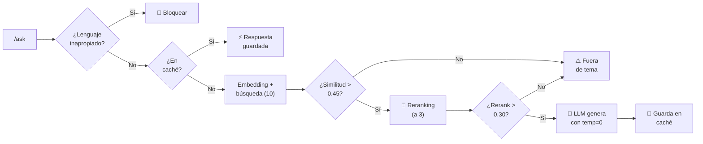

<div align="center">

# ⚖️ Asistente de Consulta — Ley de Contrato de Trabajo

**Sistema RAG que responde consultas sobre la Ley 20.744 (Argentina), citando el artículo exacto**

[](https://www.python.org/)
[](https://fastapi.tiangolo.com/)
[](https://www.trychroma.com/)
[](https://cohere.com/)

_Challenge Final — Get Talent (Pi Data)_

</div>

---

## 📑 Contenido

- [El problema](#-el-problema)
- [Instalación](#-instalación)
- [Endpoints](#-endpoints)
- [Interfaz gráfica](#-interfaz-gráfica-opcional)
- [Preguntas de ejemplo](#-preguntas-de-ejemplo)
- [Arquitectura](#-arquitectura)
- [Base de conocimiento](#-base-de-conocimiento)
- [Calidad de respuesta](#-calidad-de-respuesta)
- [IA Responsable](#-ia-responsable)
- [Verificación](#-verificación)
- [Limitaciones](#-limitaciones-conocidas)

---

## 🎯 El problema

Consultar la Ley de Contrato de Trabajo (20.744) hoy significa buscar en un texto
de más de 280 artículos, con reformas recientes (Ley 27.802, marzo 2026) que
sustituyeron o derogaron partes del articulado. Encontrar el artículo correcto
—y saber si sigue vigente— no es inmediato.

Este asistente responde en lenguaje natural, cita el artículo exacto, advierte
si está derogado, y se niega a responder sobre cualquier tema fuera de la ley.

---

## ⚙️ Instalación

**1.** Instalar dependencias

```bash
pip install -r requirements.txt
```

**2.** Copiar `.env.example` como `.env` y completar con la clave de Cohere

```bash
COHERE_API_KEY=tu_api_key_aca
```

**3.** Cargar la base de conocimiento (una sola vez)

```bash
python descargar_ley.py         # descarga y limpia el texto de la ley
python ingesta.py --verificar   # revisa el parseo SIN llamar a Cohere
python ingesta.py               # genera embeddings y carga ChromaDB
```

**4.** Levantar la API

```bash
uvicorn main:app --reload
```

> 💡 Documentación interactiva en **http://localhost:8000/docs**
> Verificación rápida en **http://localhost:8000/health**

**5.** (Opcional) Levantar la interfaz gráfica, en **otra terminal**, con la API
del paso 4 corriendo

```bash
streamlit run gui.py
```

Se abre sola en el navegador en `http://localhost:8501`.

---

## 🔌 Endpoints

|     | Método | Ruta        | Descripción                                                                         |
| :-: | :----: | ----------- | ----------------------------------------------------------------------------------- |
| 💚  | `GET`  | `/health`   | Estado del servicio: fragmentos indexados, modelos, Top-K, umbrales, caché          |
| 🔍  | `POST` | `/retrieve` | **Solo retrieval**: devuelve los fragmentos recuperados con sus scores, sin llamar al LLM |
| 💬  | `POST` | `/ask`      | Pregunta → retrieval → contexto → prompt → LLM → respuesta + fuentes                |

Todos los errores salen con el mismo formato `{"error": "..."}`: `422` si la
entrada es inválida (pregunta vacía, JSON mal formado), `503` si Cohere no
responde, `404` si la ruta no existe.

<details>
<summary><b>Ver ejemplo de <code>/retrieve</code></b></summary>

<br>

`top_k` (1 a 10, por defecto 3) y `excluir_derogados` (por defecto `false`)
son opcionales.

```bash
curl -X POST http://localhost:8000/retrieve   -H "Content-Type: application/json"   -d '{"pregunta": "que dice la ley sobre el periodo de prueba", "top_k": 3}'
```

**Respuesta** (texto recortado):

```json
{
  "pregunta": "que dice la ley sobre el periodo de prueba",
  "pertinente": true,
  "motivo": "ok",
  "similarity_score": 0.7111,
  "umbral_similitud": 0.45,
  "umbral_rerank": 0.3,
  "fragmentos": [
    { "articulo": "92 bis", "score": 0.7111, "score_rerank": 0.8451, "derogado": false, "texto": "Art. 92 bis. — Período de prueba. ..." },
    { "articulo": "231",    "score": 0.5518, "score_rerank": 0.7817, "derogado": false, "texto": "Art. 231. —Plazos. ..." },
    { "articulo": "50",     "score": 0.6281, "score_rerank": 0.5695, "derogado": false, "texto": "Art. 50. —Prueba. ..." }
  ]
}
```

`motivo` explica la decisión: `ok`, `sin_resultados`, `similitud_bajo_umbral`
o `rerank_bajo_umbral`. Si no es pertinente, igual se devuelven los mejores
candidatos, para poder ver por qué no alcanzaron.

</details>

<details>
<summary><b>Ver ejemplo de <code>/ask</code></b></summary>

<br>

```bash
curl -X POST http://localhost:8000/ask   -H "Content-Type: application/json"   -d '{"pregunta": "cuantos dias de vacaciones me corresponden con 8 años de antiguedad"}'
```

**Respuesta** (se muestra solo la primera de las tres fuentes):

```json
{
  "pregunta": "cuantos dias de vacaciones me corresponden con 8 años de antiguedad",
  "respuesta": "Según el artículo 150, te corresponden 21 días corridos de vacaciones.

Este artículo establece que los trabajadores con una antigüedad mayor a cinco años, pero que no supere los diez, tienen derecho a veintiún días corridos de descanso anual remunerado.",
  "fuentes": [
    { "articulo": "150", "titulo": "V - De las Vacaciones y otras Licencias", "capitulo": "I - Régimen General", "derogado": false, "score": 0.6578, "score_rerank": 0.8679 }
  ],
  "similarity_score": 0.6578,
  "grounded": true,
  "desde_cache": false,
  "aviso": "Información general basada en el texto de la Ley 20.744. No constituye asesoramiento legal. Ante un caso concreto, consultá a un profesional del derecho."
}
```

</details>

---

## 🖥️ Interfaz gráfica (opcional)

`gui.py` es una pantalla simple hecha con [Streamlit](https://streamlit.io/)
para consultar el asistente sin usar Swagger ni la terminal. **No es la API:
es una pantalla aparte que le hace pedidos a `/ask`.** Por eso hacen
falta dos procesos corriendo al mismo tiempo (ver [Instalación](#-instalación)).

Muestra la respuesta, los artículos citados —marcando en rojo si alguno está
derogado—, y el aviso legal. Si la API no está levantada, avisa con un
mensaje claro en vez de romperse.

---

## ❓ Preguntas de ejemplo

Diez consultas pensadas para alguien que no conoce la ley y quiere saber
qué le corresponde. Cubren los temas más consultados de la Ley 20.744:
vacaciones, período de prueba, preaviso, sueldo anual complementario,
licencias especiales, jornada laboral y despido.

1. ¿Cuántos días de vacaciones me corresponden según mi antigüedad?
2. ¿Qué es el período de prueba y cuánto dura?
3. ¿Cuánto tiempo de preaviso debe dar el empleador antes de un despido?
4. ¿Qué es el sueldo anual complementario y cuándo se paga?
5. ¿Qué licencia especial otorga la ley por nacimiento de un hijo?
6. ¿Cuántos días de licencia corresponden por matrimonio?
7. ¿Qué días de licencia se otorgan por fallecimiento de un familiar directo?
8. ¿Qué dice la ley sobre la jornada de trabajo y el descanso semanal?
9. ¿Qué indemnización corresponde si me despiden sin causa justificada?
10. ¿Qué licencia paga corresponde por enfermedad o accidente que no sea
    laboral?

> Estas preguntas no se probaron una por una contra la API antes de
> publicarlas acá; se eligieron por tratarse de institutos que la Ley 20.744
> regula de forma directa. Se recomienda ejecutarlas una vez antes de la
> presentación.

---

## 🏗️ Arquitectura

```
📁 proyecto/
├── 🌐 descargar_ley.py      Descarga y limpia el texto de la ley (se corre 1 vez)
├── 📥 ingesta.py            Parte por artículo, arma metadata, carga ChromaDB (se corre 1 vez)
├── 🐍 main.py               API: /health, /retrieve, /ask. Guardrail, caché, orquesta la respuesta
├── 🧠 rag.py                Retrieval (búsqueda + filtros + reranking), prompt, generación
├── 📋 schemas.py            Contratos de entrada y salida (Pydantic)
├── 📄 ley/ley_20744.txt     El texto fuente, limpio (175.753 caracteres)
└── 🔐 .env                  Clave de Cohere (no versionado)
```

**Flujo de una consulta:**



Dos filtros en cascada, cada uno con su propia escala y su propia calibración
(ver [Calidad de respuesta](#-calidad-de-respuesta)): la similitud de embeddings
decide si el tema es pertinente; el reranking decide, entre los candidatos
pertinentes, cuáles responden la pregunta puntual.

### Modelos de Cohere utilizados

| Función                            | Modelo                    |
| ---------------------------------- | ------------------------- |
| Embeddings (indexación y búsqueda) | `embed-multilingual-v3.0` |
| Generación de respuestas           | `command-a-03-2025`       |
| Reranking                          | `rerank-v4.0-fast`        |

Los tres nombres están centralizados en constantes al inicio de `rag.py`
(`MODELO_EMBEDDINGS`, `MODELO_CHAT`, `MODELO_RERANK`), no repartidos por el
código. Cohere deprecó dos modelos durante el desarrollo de este mismo
proyecto —`command-r-plus` en septiembre de 2025 y `rerank-v3.5` en julio de
2026—, así que actualizar el nombre vigente es editar una sola línea.

---

## 📚 Base de conocimiento

|                            |                                                                                                                                                    |
| -------------------------- | -------------------------------------------------------------------------------------------------------------------------------------------------- |
| **Fuente**                 | Ley 20.744 (Contrato de Trabajo), texto actualizado, [argentina.gob.ar](https://www.argentina.gob.ar/normativa/nacional/norma-25552/actualizacion) |
| **Tamaño**                 | 175.753 caracteres (mínimo exigido: 100.000)                                                                                                       |
| **Artículos**              | 278 números distintos (1 a 278), sin faltantes, más 14 con sufijo bis/ter                                                                          |
| **Fragmentos indexados**   | 317                                                                                                                                                |
| **Estrategia de chunking** | Por **artículo completo**, no por caracteres fijos                                                                                                 |
| **Metadata por fragmento** | ley, número de artículo, título, capítulo, si está derogado                                                                                        |
| **Base vectorial**         | ChromaDB, `PersistentClient`, distancia coseno                                                                                                     |

**Por qué se chunkea por artículo y no por caracteres fijos:** la ley trae
reformas recientes con anotaciones de vigencia pegadas a cada artículo
(_"Artículo sustituido por art. 57 de la Ley Nº 27.802"_). Cortar por
caracteres fijos podía separar un artículo de su nota de vigencia, con el
riesgo de citar como vigente una norma derogada. Chunkear por artículo
garantiza que el texto y su estado de vigencia viajen siempre juntos.

Los artículos que superan los 1.500 caracteres (47 de 293) se subdividen,
porque Cohere trunca en silencio todo lo que supere ~512 tokens por texto.

---

## ✅ Calidad de respuesta

### Pertinencia — dos filtros en cascada

**Filtro 1 — similitud de embeddings (`UMBRAL_SIMILITUD = 0.45`)**

Calibrado con 6 mediciones reales contra el texto de la ley ya cargado:

| Consulta             | Score  |
| -------------------- | :----: |
| Salario mínimo       | 0.7188 |
| Período de prueba    | 0.7113 |
| Vacaciones (español) | 0.6578 |
| Vacaciones (inglés)  | 0.5654 |
| _(piso de señal)_    |        |
| Tarta de manzana     | 0.3440 |
| Capital de Francia   | 0.3303 |

Con 11 puntos de margen a cada lado, el umbral corta antes de gastar una
llamada al reranker o al modelo generativo.

**Filtro 2 — reranking (`UMBRAL_RERANK = 0.30`, escala independiente)**

Medido con las mismas consultas:

| Tipo de consulta             | Score de rerank |
| ---------------------------- | :-------------: |
| Pertinentes (mejor artículo) |   0.57 a 0.91   |
| Fuera de tema                |   0.09 a 0.11   |

La separación es más del doble de nítida que la de embeddings (brecha de 0.80
contra 0.37), porque el reranker lee la pregunta y el artículo **juntos**,
mientras que el embedding compara dos resúmenes numéricos calculados por
separado.

**Por qué dos filtros y no uno:** el embedding filtra si el _tema_ es
pertinente; el reranking filtra si el _artículo puntual_ responde la pregunta.
Son preguntas distintas. Ejemplo real detectado durante la calibración: en
_"qué dice la ley sobre el período de prueba"_, el artículo 50 (que regula
la _prueba_ como medio de acreditación del contrato, no el _período de
prueba_) entraba en el top 3 por similitud de vocabulario compartido —el
reranking lo bajó al tercer puesto y subió el artículo 231 (preaviso), al
que el propio 92 bis remite.

**Si el reranker no responde**, el sistema sigue funcionando con el orden de
similitud: es una mejora de calidad, no una dependencia crítica.

### Determinismo

`temperature = 0` en la generación, más un caché de respuestas
(`cache_respuestas.json`) indexado por la pregunta normalizada (sin tildes,
sin signos, sin mayúsculas). _"¿Cuántos días de vacaciones?"_ y _"cuantos
dias de vacaciones"_ devuelven exactamente la misma respuesta, verificado.

`temperature = 0` sola no garantiza determinismo absoluto en los LLM; el
caché sí.

### Formato

- **Sin emojis:** instrucción explícita en el prompt + filtro por rangos
  Unicode que los elimina de la respuesta aunque el modelo los genere.
- **Siempre en español:** instrucción en el prompt, verificado con una
  consulta en inglés.

---

## 🛡️ IA Responsable

|     | Práctica                   | Implementación                                                                                                                                                                                                                    |
| :-: | -------------------------- | --------------------------------------------------------------------------------------------------------------------------------------------------------------------------------------------------------------------------------- |
| ⚓  | **Grounding doble**        | El score debe superar ambos umbrales. Además, si el propio modelo reconoce que el contexto no alcanza (caso real: salario mínimo vital), `grounded` se marca `false` aunque el score haya sido el más alto de toda la calibración |
| 🔒  | **Protección de datos**    | Los logs registran longitud de la consulta y scores, nunca el texto. Los `except` registran el tipo de excepción, no el mensaje, para no filtrar rutas ni claves                                                                  |
| 👁️  | **Transparencia**          | Cada respuesta incluye los artículos usados, los dos scores, si vino del caché, y un aviso legal fijo                                                                                                                             |
| ⚖️  | **Equidad**                | Filtro de lenguaje inapropiado con límite de palabra (`\b`), para no marcar términos legítimos que contengan una palabra bloqueada                                                                                                |
| 📋  | **No asesoramiento legal** | Aviso explícito en cada respuesta: es información general, no reemplaza a un profesional del derecho                                                                                                                              |
| 🔍  | **Trazabilidad**           | Cada consulta tiene un ID de traza; el log reconstruye los 5 pasos de la decisión (guardrail → caché → búsqueda → filtros → generación)                                                                                           |

---

## 🧪 Verificación

Probado end-to-end contra la API de Cohere con el texto completo de la ley cargado:

| Caso                                                                                | Resultado                                                                 |
| ----------------------------------------------------------------------------------- | ------------------------------------------------------------------------- |
| 💬 Pregunta con respuesta en la ley                                                 | Cita el artículo exacto, `grounded: true`                                 |
| 🤷 Pregunta sobre un concepto que la ley define pero no cuantifica (salario mínimo) | Reconoce que no alcanza, `grounded: false`, pese al score más alto medido |
| 🌐 Pregunta en inglés                                                               | Responde en español                                                       |
| 🚫 Pregunta fuera de tema                                                           | Rechaza sin llamar al modelo generativo                                   |
| ⛔ Lenguaje inapropiado                                                             | Bloquea antes de buscar                                                   |
| 🔁 Misma pregunta, dos formas de escribirla                                         | Respuesta idéntica, `desde_cache: true` en la segunda                     |
| 🔀 Reranking vs. solo similitud                                                     | Corrige 2 de 3 casos con artículos citados de más                         |

---

## 📌 Limitaciones conocidas

- **No es asesoramiento legal.** El sistema informa qué dice la ley; no
  reemplaza la consulta a un profesional para un caso concreto.
- **Una sola norma indexada.** Solo la Ley 20.744. No contempla convenios
  colectivos, decretos reglamentarios ni jurisprudencia, que pueden modificar
  la aplicación práctica de un artículo.
- **Umbrales calibrados sobre este texto.** Si se agregan más normas, ambos
  umbrales deberían remedirse.
- **Filtro de lenguaje por lista fija.** No detecta intención, solo términos
  literales.
- **Dependencia de modelos externos versionados.** Cohere deprecó
  `command-r-plus` en septiembre de 2025 y `rerank-v3.5` en julio de 2026
  durante el desarrollo de este mismo proyecto. Los tres modelos usados están
  centralizados en constantes al inicio de `rag.py` para poder actualizarlos
  sin tocar el resto del código.
- **Caché en archivo local.** Sirve para la demo y para el requisito de
  determinismo; en un despliegue con múltiples instancias necesitaría una
  base compartida (Redis, por ejemplo).
